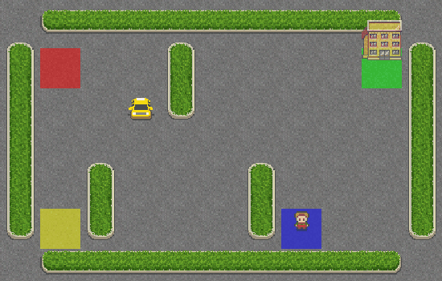

# IEEE Report (Readable Version)

## Project Title
Hierarchical Reinforcement Learning for Taxi-v3: A Comparative Study of Flat Q-Learning and Options

## Student Details
Name: Ravi Jangid  
Registration Number: 22MIC7020  
Department: CSE  
University: VIT-AP University

## Abstract
This project compares two reinforcement learning approaches on the Taxi-v3 task: Flat Q-Learning and an Options-based Hierarchical RL method. The goal is to study how learning quality changes when training episodes increase. For demonstration, I trained both agents with episode budgets of 1, 10, 100, and 3000, and then compared their behavior using metrics and rollout GIFs.

The project records average return, success rate, number of steps, illegal actions, efficiency, and illegal-action ratio. Results show that in this implementation, Flat Q-Learning improves faster than the Options agent for low and medium budgets. The Options method needs better option learning and termination design to match or exceed flat performance. This report also includes interpretation guidance so the results can be explained clearly during viva or classroom demonstration.

## 1. Introduction
Reinforcement learning (RL) is a framework where an agent learns by trial and error. In Taxi-v3, the agent must pick up and drop off a passenger at the correct destination. This environment is a standard benchmark for studying discrete RL algorithms.

This project demonstrates:
1. How a flat policy learns over time.
2. How a hierarchical policy with options behaves under the same conditions.
3. How training budget affects intelligence and task success.

This document is intentionally written in readable language while preserving technical correctness. It can be used directly for presentation preparation and then converted into formal IEEE wording.

## 1.1 Problem Statement
Given the Taxi-v3 environment, train and compare:
1. A flat tabular Q-Learning agent.
2. A tabular options-based hierarchical agent.

Evaluate whether the hierarchical design provides better sample efficiency and better behavior under increasing training budgets.

## 2. Environment Setup
- Environment: Taxi-v3 (default 5x5 grid)
- Actions: 6 (north, south, east, west, pickup, dropoff)
- Max steps per episode: 200

Reward design:
- +20 for successful dropoff
- -1 per time step
- -10 for illegal pickup/dropoff

State representation in Taxi-v3 encodes taxi location, passenger location, and destination into a discrete integer state. This allows direct tabular learning without function approximation.

## 3. Methods
### 3.1 Flat Q-Learning
The flat agent learns one Q-table over state-action pairs.

Update rule:
Q(s,a) <- Q(s,a) + alpha * [r + gamma * max(Q(s',a')) - Q(s,a)]

Why this baseline is strong in Taxi-v3:
1. Small discrete state/action space.
2. Dense enough learning signal from step penalties and legal/illegal rewards.
3. Low implementation complexity and stable updates.

### 3.2 Options-Based Hierarchical RL
The hierarchical agent learns values over state-option-action tuples. A high-level controller picks an option, and a low-level controller picks actions under that option.

Key settings used in this project:
- Number of options: 4
- Beta (termination probability): 0.05
- Epsilon decay for options: from 0.1 down to 0.02

Potential hierarchical advantage:
1. Reusable sub-behaviors such as navigation and pickup strategy.
2. Temporal abstraction over primitive actions.
3. Better credit assignment in long-horizon settings.

Current limitation:
Termination is fixed-probability rather than learned per state-option pair.

## 3.3 Training and Evaluation Protocol
For each budget in {1, 10, 100, 3000}:
1. Train flat agent for N episodes.
2. Train options agent for N episodes.
3. Evaluate each for multiple episodes with fixed seeds.
4. Save metrics and GIF trajectories.

This protocol is designed to show both quantitative and qualitative learning progress.

## 4. Experiment Design
Training budgets compared:
- 1 episode
- 10 episodes
- 100 episodes
- 3000 episodes

For each budget:
1. Train flat agent.
2. Train options agent.
3. Evaluate each over multiple episodes.
4. Save metrics and GIF rollouts.

Artifacts generated:
- hrl_taxi/reports/figures/demo_episode_comparison/episode_budget_metrics.csv
- hrl_taxi/reports/figures/demo_episode_comparison/episode_budget_comparison.png
- GIFs: flat_budget_*.gif, options_budget_*.gif

Demonstration flow suggestion:
1. Start with budget-1 GIFs for both agents.
2. Move to budget-100 and budget-3000 GIFs.
3. Show the comparison plot.
4. Explain metric trends and why options lag in this implementation.

## 5. Results (Current Run)
| Agent | Budget | Avg Return | Avg Steps | Success Rate | Avg Illegal |
|---|---:|---:|---:|---:|---:|
| Flat | 1 | -218.00 | 200.00 | 0.000 | 2.00 |
| Options | 1 | -200.00 | 200.00 | 0.000 | 0.00 |
| Flat | 10 | -235.96 | 200.00 | 0.000 | 3.99 |
| Options | 10 | -380.00 | 200.00 | 0.000 | 20.00 |
| Flat | 100 | -235.91 | 200.00 | 0.000 | 3.99 |
| Options | 100 | -326.00 | 200.00 | 0.000 | 14.00 |
| Flat | 3000 | 7.03 | 13.86 | 0.995 | 0.00 |
| Options | 3000 | -126.56 | 93.46 | 0.565 | 4.99 |

## 6. Analysis
Main observations:
1. At low budgets (1 to 100), both agents struggle to complete the task.
2. At 3000 episodes, Flat Q-Learning shows clear improvement in return and success.
3. In this implementation, Options remains unstable and less successful.

Why options underperform here:
1. Termination is fixed and stochastic, not learned per state.
2. The value function space is larger (state, option, action), so learning is slower.
3. Exploration happens at both option and action levels, increasing variance.

Additional insights:
1. Flat policy shows early gains in success rate when budget reaches 3000.
2. Options policy shows partial progress but still spends many episodes near step limit.
3. Illegal actions for options remain comparatively high at equal budget.

## 6.1 Threats to Validity
1. Hyperparameter sensitivity: changing beta, epsilon decay, or option count can alter outcomes.
2. Seed sensitivity: single-seed runs can overstate or understate stability.
3. Environment size: Taxi-v3 is small; conclusions should be tested on harder tasks.

## 7. Conclusion
This project successfully demonstrates how training budget affects RL behavior and performance. The generated GIFs and plots are useful for classroom presentation. In the current setup, Flat Q-Learning converges faster than the simplified Options agent.

## 8. Future Improvements
1. Implement learned option termination.
2. Run multi-seed experiments and report mean plus standard deviation.
3. Add ablation studies for beta, epsilon decay, and number of options.
4. Extend to larger grids and transfer tasks.
5. Add confidence intervals and statistical tests for stronger scientific reporting.

## 9. Can We Add GIFs in the Report?
Yes.

1. In Markdown or web reports: GIFs can be embedded directly and will animate.
2. In IEEE PDF: standard PDF does not reliably support animated GIF playback.
3. Best IEEE practice: include static key frames in the paper and provide repository link for full GIFs.

Example Markdown embeds:

Suggested IEEE caption style:
"Representative key frames are shown in-paper; full rollout animations are provided in supplementary repository artifacts."

## References
1. Sutton and Barto, Reinforcement Learning: An Introduction, 2nd Edition, 2018.
2. Sutton, Precup, and Singh, Between MDPs and Semi-MDPs, 1999.
3. Bacon, Harb, and Precup, The Option-Critic Architecture, AAAI 2017.
